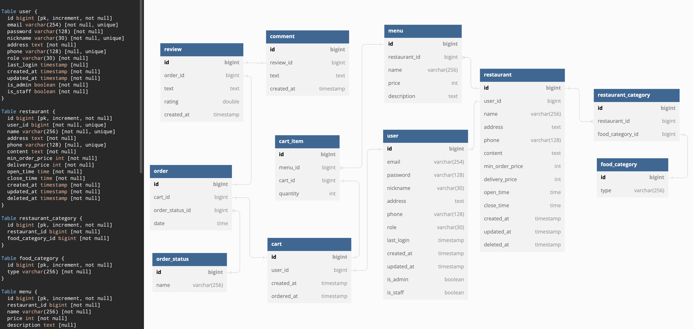

# 프로젝트 개요
배민, 요기요, 쿠팡 잇츠 같은 배달 서비스의 기능을 구현한 프로젝트 입니다.
기존의 서비스의 기능을 따라 만들면서 설계와 구현에 숙련도를 높이고자 합니다.

# 사용 기술 및 환경
- python 3.9
- Django 4.1.2
- PostgreSQL 14.5
- Docker

# 프로젝트 구조
```text
masitda
├── ...
├── Dockerfile
├── README.md // 프로젝트 내용 설명 파일
├── accounts // 계정 관리(회원가입, 로그인, 로그아웃) 앱
├── api // 프로젝트를 위한 파이썬 패키지들이 저장되는 디렉토리
├── cores // 주요 기능이 구현된 앱
├── docker-compose.yml
├── manage.py 
├── poetry.lock
└── pyproject.toml
```

# 데이터베이스 ERD


# 기능 설명
### User
- **[회원 가입]**
  - [POST] `/users`
    - 회원가입하는 api입니다.
    - 이메일, 닉네임 validation 설정
    - 패스워드는 장고 기본 인증을 따라 DB에 저장될 때 암호화 합니다.
    - 다음과 같은 내용은 Request Body에 반드시 필요합니다.
      - `nickname`
      - `email`
      - `address`
      - `password`
      - `phone`
      - `role`
- **[로그인]**
  - [POST] `/login`
    - 로그인하는 api입니다.
    - DRF의 authToken을 사용해서 토큰을 생성하고 반환 합니다.
    - 다음과 같은 내용은 Request Body에 반드시 필요합니다.
      - `email`
      - `password`
- **[로그아웃]**
  - [GET] `/logout`
    - 로그아웃하는 api입니다.
    - 인증된 유저만 요청할 수 있고, 해당 계정의 토큰을 삭제합니다.
    - 다음과 같은 내용은 Header에 반드시 필요합니다.
      - `Authorization: token {token 값}`

### Restaurant & Menu
- **[음식점 리스트 요청, 생성]**
  - `/v1/restaurants/`
    - [GET]
      - 음식점 목록을 요청하는 api, 인증된 유저 누구나 접근 가능합니다.
      - 리스트 형식으로 음식점 정보를 반환합니다.
    - [POST]
      - 음식점을 생성하는 api, 사장 권한을 가지고 있는 사용자만 사용 가능합니다.
      - 음식점이 성공적으로 생성되면 201 반환, 실패하면 400 반환합니다.
- **[음식점 자세한 정보 요청, 수정]**
  - `/v1/restaurants/{restaurant_pk}`
    - [GET]
      - 해당 음식점의 자세한 정보를 요청하는 api, 인증된 유저 누구나 접근 가능합니다.
      - 해당 음식점이 존재하지 않으면 404 반환하고, 존재하면 200과 함께 데이터를 반환합니다.
    - [PATCH]
      - 해당 음식점의 정보를 수정하는  api, 해당 음식점의 사장님만 가능합니다.
      - 권한이 없다면 403 반환, 해당 음식점이 없으면 404 반환, 업데이트 성공하면 200 반환, 실패하면 400 반환합니다.
      - 부분적으로 수정할 부분만 요청 가능할 수 있습니다.
- **[음식점 메뉴 추가]**
  - `/v1/restaurants/{restaurant_pk}/menus`
    - [POST]
      - 음식점에 메뉴를 생성하는 api, 해당 음식점의 사장님만 가능합니다.
      - 권한이 없다면 403 반환, 해당 음식점이 없으면 404 반환, 메뉴 생성이 되면 201 반환, 실패하면 400 반환합니다.
- **[음식점 메뉴 수정, 삭제]**
- `/v1/restaurants/{restaurant_pk}/menus/{menu_pk}`
  - [PATCH]
    - 해당 음식점의 메뉴를 수정하는 api, 해당 음식점의 사장님만 가능합니다.
    - 권한이 없으면 403 반환, 해당 음식점이나 메뉴가 없다면 404 반환, 수정이 되면 200 반환, 실패하면 400 반환합니다.
    - 부분적으로 수정할 부분만  요청 가능
  - [DELETE]
    - 해당 음식점의 메뉴를 삭제하는 api, 해당 음식점의 사장님만 가능합니다.
    - 권한이 없으면 403 반환, 해당 음식점이나 메뉴가 없다면 404 반환, 삭제되면 204 반환합니다.

### Cart
- **[장바구니 생성]**
  - `/v1/carts`
    - [POST]
      - 장바구니 생성하는 api입니다.
      - 장바구니가 없으면 새롭게 생성하고 기존의 장바구니가 있다면 반환합니다.
      - 음식점이 다른 메뉴를 장바구니에 담을려고 하면 400 반환합니다.
      - 다음과 같은 값은 Request Body에 있어야 합니다.
        - `menu`
        - `quantity`
- **[장바구니 조회, 삭제]**
  - `/v1/carts/{cart_id}`
    - [GET]
      - 장바구니 조회하는 api입니다.
      - 인증된 유저만 요청할 수 있으며, 자신의 장바구니에만 요청할 수 있습니다.
    - [DELETE]
      - 장바구니 삭제하는 api입니다.
      - 인증된 유저만 요청할 수 있으며, 자신의 장바구니에만 요청할 수 있습니다.
- **[장바구니 아이템 수정, 삭제]**
  - `/v1/carts/item/{item_id}`
    - [PATCH]
      - 장바구니에 담긴 특정 아이템을 수정하는 api입니다.
      - 인증된 유저만 요청할 수 있으며, 자신의 장바구니에만 요청할 수 있습니다.
      - 아이템의 수량을 수정할 땐 1개 이상이어야 합니다.
    - [DELETE]
      - 장바구니에 담긴 특정 아이템을 삭제하는 api입니다.
      - 인증된 유저만 요청할 수 있으며, 자신의 장바구니에만 요청할 수 있습니다.

### Order
- **[주문 요청]**
  - `/v1/carts/{cart_id}/orders`
    - [POST]
      - 장바구니 주문하는 api입니다.
      - 장바구니가 존재하는 유저만 요청할 수 있습니다.
- **[주문 기록 조회]**
  - `/v1/orders`
    - [GET]
      - 주문 기록을 조회하는 api입니다.
      - 과거 주문 기록이 리스트로 반환됩니다.
- **[특정 주문 조회, 수정, 취소]**
  - `/orders/{order_id}`
    - [GET]
      - 특정 주문 기록을 조회하는 api입니다.
      - 자신의 주문에 대해서만 조회할 수 있습니다.
    - [PATCH]
      - 주문을 수락하거나 취소하는 api입니다.
      - 음식점 사장만 수락이나 취소를 할 수 있습니다. 수락은 취소가 되지 않은 경우에 가능합니다.
    - [DELETE]
      - 수락이 되기 전의 주문을 취소하는 api입니다.
      - 회원만 요청할 수 있습니다.

### Review
- **[리뷰 등록]**
  - `/v1/orders/<int:order_id>/reviews`
    - [POST]
      - 주문 했던 것에 대해 리뷰를 등록하는 api입니다.
      - 자신이 주문했던 것에 대해서만 리뷰를 남길 수 있습니다.
- **[리뷰 삭제]**
  - `/v1/reviews/<int:review_id>`
    - [DELETE]
      - 자신이 등록했던 리뷰를 삭제하는 api입니다.
      - 리뷰가 존재하지 않으면 `Not Found`를 반환합니다.
- **[리뷰 기록 요청]**
  - `/v1/users/<int:user_id>/reviews`
    - [GET]
      - 자신이 그동안 남긴 리뷰들을 확인하는 api입니다.

### Comment
- **[답글 등록]**
  - `v1/reviews/<int:review_id>/comments`
  - [POST]
    - 자신의 음식점에 달린 리뷰에 답글 등록하는 api 입니다.
- **[답글 삭제]**
  - `v1/reviews/<int:review_id>/comments/<int:comment_id>`
  - [DELETE]
    - 리뷰에 단 답글을 삭제하는 api 입니다.
